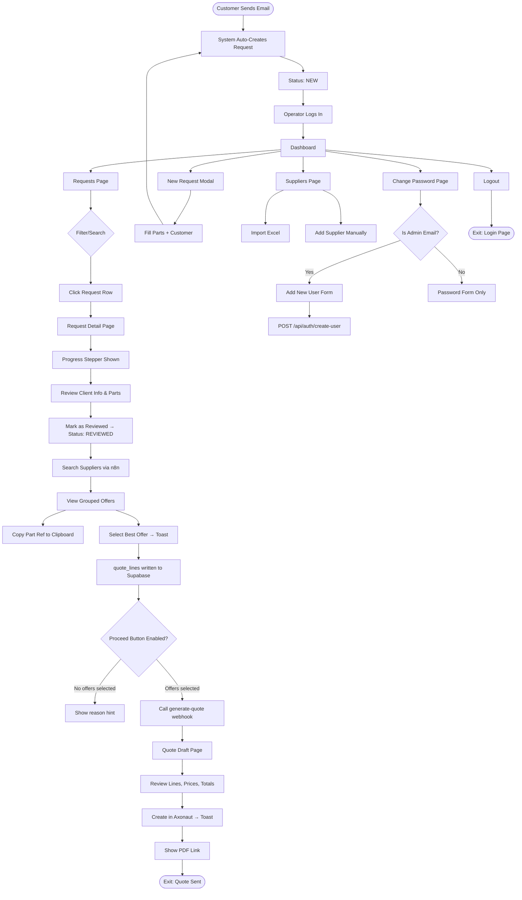
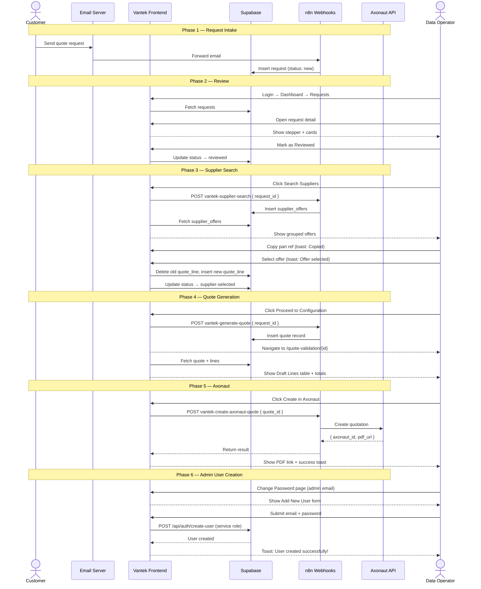
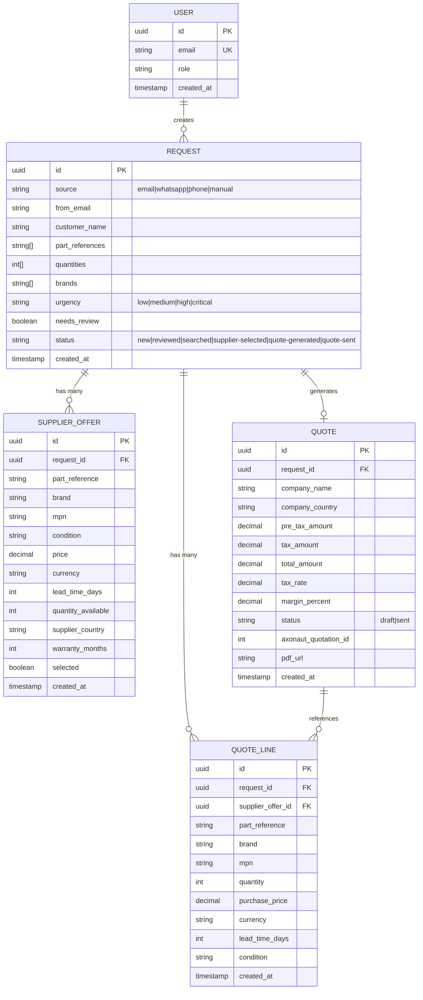

# User Story: Vantek Industrial Parts Quote Management System

**Feature ID:** 001  
**Feature Name:** Complete Quote Management Workflow  
**Last Updated:** May 2026  
**Status:** Live

---

## Executive Summary

Vantek is a B2B industrial parts quote management system that streamlines the entire quote lifecycle — from receiving customer requests via email to generating and sending professional quotes. The system serves data operators who process incoming requests, search for supplier offers, calculate margins, and deliver quotes to customers. It supports French and English, has a centralized config for all webhooks and admin access, and includes UX improvements like a progress stepper, toast notifications, copy-to-clipboard, and age color coding.

---

## Actors

### Primary Actors

1. **Data Operator / Assistant**
   - Role: Internal staff member who processes quote requests
   - Responsibilities: Review requests, search suppliers, select offers, configure and send quotes
   - Access Level: Full dashboard access (authenticated)

2. **Admin Operator**
   - Role: Elevated operator who can also create new Supabase users
   - Defined by: Email listed in `config.adminEmails`
   - Extra capability: "Add New User" section visible on Change Password page
   - Current admins: `agence.veliosai@gmail.com`, `abdulhannan.personal@gmail.com`, `pythonfor18@gmail.com`

3. **Customer** (External)
   - Role: Industrial parts buyer sending quote requests
   - Interaction: Sends email requests, receives PDF quotes
   - Access Level: No direct system access

---

## User Stories

### Epic 1: Authentication & Entry

**US-001: Login**
- As a Data Operator, I want to log in with email and password to access the system securely
- ✅ Credentials validated via Supabase Auth
- ✅ On success → redirect to `/dashboard`
- ✅ On failure → inline error message
- ✅ "Forgot password" link available
- ✅ Session persists across refreshes

**US-002: Forgot Password**
- As a Data Operator, I want to reset my password via email link
- ✅ Reset email sent via Supabase Auth

---

### Epic 2: Dashboard

**US-003: View Dashboard KPIs**
- As a Data Operator, I want to see key metrics at a glance
- ✅ KPIs: New Today, Urgent Cases, Pending Quotes, Sent This Week
- ✅ Trends vs yesterday / last week
- ✅ Chart: New Requests vs Closed Quotes (Weekly / Monthly / Yearly)
- ✅ Chart data built server-side from real request + quote data
- ✅ Urgent Cases panel with clickable rows → request detail
- ✅ Empty state: "No urgent cases right now. Everything is on track."
- ✅ Pending Requests table with age color coding (green <1h, yellow 1-24h, red >24h)
- ✅ Pipeline board showing requests by status
- ✅ Refresh button with 30s session cache

---

### Epic 3: Request Management

**US-004: View & Filter Requests**
- As a Data Operator, I want a filterable list of all requests
- ✅ Filters: Status (multi), Urgency (multi), Source, Timeframe, Request Type
- ✅ Bulk actions: change status (default: Reviewed), delete, export CSV
- ✅ Pagination with configurable page size
- ✅ Status badges use `normalizeStatus()` — handles backend variants like `Quote_draft` → `quote-generated`

**US-005: Create Manual Request**
- As a Data Operator, I want to manually create a request for phone/WhatsApp inquiries
- ✅ Modal form: customer name, email, urgency, raw text, dynamic part rows
- ✅ Brand lookup per part
- ✅ Submitted via n8n webhook (`config.webhooks.manualRequest`)

**US-006: View Request Detail**
- As a Data Operator, I want to see full request details and process it
- ✅ Progress stepper: New → Reviewed → Searched → Supplier Selected → Quote Generated → Quote Sent
  - Desktop: full horizontal stepper with animated connectors
  - Mobile: compact pill showing current step + prev/next context + progress bar
- ✅ Header: customer name, status badge, urgency selector, review button, received time
- ✅ Client Identity card (editable inline)
- ✅ Original Message card (editable inline)
- ✅ Extracted Parts table (inline editable, brand lookup, search suppliers button)
- ✅ Status normalized via `normalizeStatus()` for stepper and search enable logic

---

### Epic 4: Supplier Search & Selection

**US-007: Search Supplier Offers**
- As a Data Operator, I want to search for supplier offers for the request's parts
- ✅ Triggered via n8n webhook (`config.webhooks.supplierSearch`)
- ✅ Results grouped by part reference, sorted by price
- ✅ "Best Price" badge on cheapest offer per group
- ✅ Filters: condition, country, currency, price range, text search
- ✅ "Show More" modal for all offers

**US-008: Select Supplier Offer**
- As a Data Operator, I want to select the best offer per part
- ✅ Selecting writes to `quote_lines` table directly (Supabase)
- ✅ Changing selection: deletes old row, inserts new one
- ✅ Copy-to-clipboard on part reference (hover reveals copy icon, fires toast)
- ✅ Toast notification: "Offer selected" on success
- ✅ Request status auto-updates to `supplier-selected`

**US-009: Select Excel Supplier**
- As a Data Operator, I want to select a supplier from the Excel import database
- ✅ Excel suppliers shown alongside API offers, grouped by matched part
- ✅ Toast notification: "Supplier selected" on success

**US-010: Proceed to Quote**
- As a Data Operator, I want to proceed to quote generation after selecting offers
- ✅ "Proceed to Configuration" button disabled with reason hint when no lines selected
- ✅ When enabled: calls n8n webhook (`config.webhooks.generateQuote`) with `{ request_id }`
- ✅ Always calls webhook fresh (no stale quote short-circuit)
- ✅ Navigates to `/quote-validation/{quote_id}`

---

### Epic 5: Quote Generation & Validation

**US-011: View Quote Draft**
- As a Data Operator, I want to review the generated quote before sending
- ✅ Draft Lines table: Part | Brand | Qty | Buy Price | Sell Price | Condition | Lead Time
- ✅ Totals footer: Pre-tax | Tax | Total
- ✅ Quote header: company name, country/email, status badge, Axonaut ID badge

**US-012: Create in Axonaut**
- As a Data Operator, I want to push the quote to Axonaut
- ✅ "Create in Axonaut" button calls n8n webhook (`config.webhooks.createAxonautQuote`)
- ✅ Response: `{ axonaut_id, axonaut_number, pdf_url }`
- ✅ PDF link shown as "Open Axonaut PDF" button
- ✅ Success toast: "Axonaut quote created successfully."
- ✅ Refresh button to reload quote data

---

### Epic 6: Supplier Management

**US-013: View Supplier Database**
- As a Data Operator, I want to manage the supplier directory
- ✅ Excel suppliers table: name, code, email, phone, country, website, keywords
- ✅ Search, filter by country
- ✅ Add supplier manually
- ✅ Edit existing supplier
- ✅ Import from Excel/CSV file

---

### Epic 7: Admin — User Management

**US-014: Create New User (Admin only)**
- As an Admin Operator, I want to create new Supabase accounts for new operators
- ✅ Visible only when logged-in email is in `config.adminEmails`
- ✅ "Add New User" card on Change Password page
- ✅ Fields: email, temporary password
- ✅ Server-side: POST `/api/auth/create-user` — verifies admin email, uses Supabase service role key, `email_confirm: true` (no email verification needed)
- ✅ Success toast: "User created successfully!"
- ✅ Non-admin users see only the Change Password form

---

### Epic 8: Account Management

**US-015: Change Password**
- As a Data Operator, I want to update my password
- ✅ New password + confirm fields with show/hide toggle
- ✅ Validation: match check, min 8 chars
- ✅ Success message auto-dismisses after 3s

**US-016: Logout**
- As a Data Operator, I want to log out securely
- ✅ Logout button in sidebar
- ✅ Session cleared, redirect to `/login`

---

## Complete User Flow



---

## Sequence Diagram



---

## Data Model



---

## Use Case Diagram

```mermaid
graph TB
    subgraph "Vantek System"
        UC1[Login / Logout]
        UC2[View Dashboard]
        UC3[Manage Requests]
        UC4[Create Manual Request]
        UC5[Search Supplier Offers]
        UC6[Select Supplier Offer]
        UC7[Copy Part Reference]
        UC8[Proceed to Quote]
        UC9[View Quote Draft]
        UC10[Create in Axonaut]
        UC11[Manage Suppliers]
        UC12[Import Suppliers from Excel]
        UC13[Change Password]
        UC14[Create New User]
        UC15[Filter & Search Requests]
        UC16[Bulk Actions on Requests]
        UC17[Export Requests CSV]
    end

    Operator([Data Operator])
    Admin([Admin Operator])
    Customer([Customer])
    n8n([n8n Webhooks])
    Axonaut([Axonaut])

    Operator --> UC1
    Operator --> UC2
    Operator --> UC3
    Operator --> UC4
    Operator --> UC5
    Operator --> UC6
    Operator --> UC7
    Operator --> UC8
    Operator --> UC9
    Operator --> UC10
    Operator --> UC11
    Operator --> UC12
    Operator --> UC13
    Operator --> UC15
    Operator --> UC16
    Operator --> UC17

    Admin --> UC14
    Admin --> UC13

    Customer -->|sends email| n8n
    n8n -->|creates request| UC3
    UC8 -->|calls webhook| n8n
    UC10 -->|calls webhook| n8n
    n8n --> Axonaut
```



---

## Technical Architecture

| Layer | Technology |
|-------|-----------|
| Frontend | Next.js 16, React 19, TypeScript, Tailwind CSS 4 |
| Animations | Framer Motion |
| Database | Supabase (PostgreSQL) |
| Auth | Supabase Auth + service role for admin user creation |
| Automation | n8n webhooks (supplier search, quote generation, Axonaut) |
| External CRM | Axonaut |
| File Processing | XLSX (Excel import) |
| Icons | Lucide React |
| Charts | Recharts |
| i18n | Custom inline translation map (EN + FR) |

---

## Configuration (`lib/config.ts`)

All URLs and admin emails are centralized:

```
config.supabase.url
config.supabase.anonKey
config.webhooks.manualRequest
config.webhooks.brandLookup
config.webhooks.supplierSearch
config.webhooks.generateQuote
config.webhooks.createAxonautQuote
config.adminEmails[]
```

---

## Status Normalization

`normalizeStatus(raw)` in `features/requests/constants/request.ts` maps backend variants to canonical frontend keys:

| Backend value | Frontend key |
|--------------|-------------|
| `Quote_draft` | `quote-generated` |
| `quote_draft` | `quote-generated` |
| `supplier_selected` | `supplier-selected` |
| `New` | `new` |
| `Reviewed` | `reviewed` |

---

## Entry & Exit Points

### Entry Points
1. `/login` — email + password
2. Email automation — customer email → n8n → Supabase request created automatically

### Exit Points
1. Quote sent to customer via Axonaut PDF
2. Draft saved to Axonaut (operator continues editing there)
3. Logout → `/login`
4. Session timeout → `/login`

---

## Status Workflow

```
new → reviewed → searched → supplier-selected → quote-generated → quote-sent
```

---

## UX Features

| Feature | Description |
|---------|-------------|
| Progress Stepper | Shows all 6 stages on request detail. Desktop: full horizontal. Mobile: compact pill + progress bar |
| Toast Notifications | Auto-dismiss (3s) for: offer selected, supplier selected, copied to clipboard, Axonaut success |
| Copy to Clipboard | Hover any part reference in offer cards to reveal copy icon |
| Disabled Proceed Button | Shows reason hint when no offers selected |
| Age Color Coding | Pending requests table: green <1h, yellow 1-24h, red >24h |
| Bulk Status Default | Bulk status dropdown pre-selects "Reviewed" |
| Empty State | Urgent Cases panel shows friendly message when no urgent requests |
| Status Normalization | Backend variants auto-mapped to correct UI styles |
| Admin User Creation | Admins can create new Supabase users from Change Password page |
| Bilingual | Full EN/FR translation via `useLanguageContext()` |

---

**Document Version:** 2.0  
**Status:** Current
